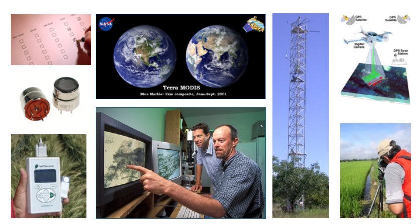

class: middle

**overview**

- why plan
- what is in a data management plan
- how to plan (Michener's ten simple rules)
- tips and tricks
- overview of DMPTool

???

# overview

---

**the data life cycle**

.pull-left[
  
]

.pull-right[
  .x-small[
    |step|action|
    |:---|:---|
    |plan|description of the data, and how the data will be managed and made accessible|
    |collect|observations into a digital form|
    |assure| quality of the data are assured through checks and inspections|
    |describe|data are accurately and thoroughly described (using the appropriate metadata standards)|
    |preserve|data are submitted to an appropriate long-term archive|
    |discover|potentially useful data are located and obtained, along with the relevant information about the data (metadata)|
    |integrate|data from disparate sources are combined to form one homogeneous set of data that can be readily analyzed|
    |analyze|data are analyzed|
  ]
]

<!--
.pull-right[
  .x-small[
    - plan:      description of the data, and how the data will be managed and made accessible
    - collect:   observations into a digital form
    - assure:    quality of the data are assured through checks and inspections
    - describe:  data are accurately and thoroughly described (using the appropriate metadata standards)
    - preserve:  data are submitted to an appropriate long-term archive
    - discover:  potentially useful data are located and obtained, along with the relevant information about the data (metadata)
    - integrate: data from disparate sources are combined to form one homogeneous set of data that can be readily analyzed
    - analyze:   data are analyzed
  ]
]
-->

.left-footnote[[DataONE](https://www.dataone.org/)]

???

# data life cycle

---
class: middle

**why plan**

???

# why plan

---
class: middle, inverse

**what is in a data management plan**

- study design
- data (including format)
- metadata
- policies for access, sharing, and reuse
- long-term storage and data management
- budget

.footnote[*attribution: W. Michener*]

???

# plan contents

---
class: center, middle

.left-footnote[W. Michener [*Ten Simple Rules for Creating a Good Data Management Plan*](https://doi.org/10.1371/journal.pcbi.1004525)]

???

# PLOS cover

---
class: middle, inverse

**ten simple rules**

1. determine the research sponsor requirements
2. identify the data to be collected
3. define how the data will be organized
4. explain how the data will be documented
5. describe how quality data will be assured
6. present a sound storage and preservation strategy
7. define the project data policies
8. describe how the data will be disseminated
9. assign roles and responsibilities
10. prepare a realistic budget

.footnote[*attribution: W. Michener*]

???

# ten simple rules

---
class: center, middle

.left-footnote[W. Michener [*Ten Simple Rules for Creating a Good Data Management Plan*](https://doi.org/10.1371/journal.pcbi.1004525)]

???

# data life cycle & DMP

---
class: middle, inverse

**1. determine the research sponsor requirements**

- NSF
- NIH
- USDA
- Gordon and Betty Moore Foundation
- Sloan Foundation

.footnote[*attribution: W. Michener*]

???

# rule 1 - text

---
class: middle

**2. identify the data to be collected**

.footnote[*attribution: W. Michener*]

???

# rule 2 - image

---
class: middle, inverse

**3. define how the data will be organized**

- database(s)
- geodatabase(s)
- tabular files

.footnote[*attribution: W. Michener*]

???

# rule 3 - text

---
class: middle

**4. explain how the data will be documented**

.footnote[*attribution: W. Michener*]

???

# rule 4 - image

---
class: middle, inverse

**5. describe how quality data will be assured**

- training activities
- instrument calibration and verification tests
- double-blind data entry
- statistical and visualization approaches to error detection

.footnote[*attribution: W. Michener*]

???

# rule 5 - text

---
class: middle

**6. present a sound storage and preservation strategy**

.footnote[*attribution: W. Michener*]

???

# rule 6 - image

---
class: middle, inverse

**7. define the project data policies**

- licensing and data-sharing arrangements
- human subject and other sensitive data

.footnote[*attribution: W. Michener*]

???

# rule 7 - text

---
class: middle

**8. describe how the data will be disseminated**

active, robust, and preferred approaches include:

- publishing the data in an open repository or archive
- submitting the data as appendices or supplements to journal articles
- publishing the data, metadata, and relevant code as a data paper

.footnote[*attribution: W. Michener*]

???

# rule 8 - text

---
class: middle, inverse

**9. assign roles and responsibilities**

roles may include:

- data collection
- data entry
- QA/QC
- metadata creation and management
- data preparation and submission to an archive
- systems administration.

.footnote[*attribution: W. Michener*]

???

# rule 9 - text

---
class: middle

**10. prepare a realistic budget**

Review your plan and make sure that there are lines in the budget to support the people that manage the data as well as pay for the requisite hardware, software

.footnote[*attribution: W. Michener*]

???

# rule 10 - text

---
class: middle, inverse

Some Michener words of wisdom

- engage your team
- plan from the start
- follow good advice
  + [DataONE](https://www.dataone.org/)
  + institutional libraries (e.g., [ASU library guides](https://libguides.asu.edu/))
  + [EDI](https://environmentaldatainitiative.org/)
- use good tools
  + [DMPTool](https://dmptool.org/)
  + [DMPOnline](https://dmponline.dcc.ac.uk/)
- review and revise

*Remember that this is part of a proposal, and will contribute to the overall evaluation of the proposal.*

.footnote[*attribution: W. Michener*]

???

# best practices

---
class: middle

*It's not thinking, 'This is easiest for myself right now.' It's thinking, 'When I'm working on this next week, next month, right before I graduate — how do I set myself up so that it’s easier later?'*  
 
J. Lowndes

.footnote[Perkel 2018 [*A toolkit for data transparency takes shape*](https://doi.org/10.1038/d41586-018-05990-5)]

???

# thinking ahead
